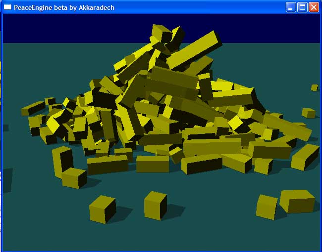

## PeaceEngine

### Description

The main goal of this project is to create peaceful 3d simulation/rendering engine,

Which can use with various computer languages. I planning to cross platform too but may not be very soon.

Current it still at very beta state. Some physics and rendering feature will be gradually added soon.

This demo show how ease of use of PeaceEngine.
 
### More Info
 

             |
---                |---
**Submitted On**   |2008-03-09 11:00:02
**By**             |[Akkaradech Sujanil](https://github.com/Planet-Source-Code/PSCIndex/blob/master/ByAuthor/akkaradech-sujanil.md)
**Level**          |Beginner
**User Rating**    |5.0 (15 globes from 3 users)
**Compatibility**  |VB 5\.0, VB 6\.0
**Category**       |[DirectX](https://github.com/Planet-Source-Code/PSCIndex/blob/master/ByCategory/directx__1-44.md)
**World**          |[Visual Basic](https://github.com/Planet-Source-Code/PSCIndex/blob/master/ByWorld/visual-basic.md)
**Archive File**   |[PeaceEngin210533392008\.zip](https://github.com/Planet-Source-Code/akkaradech-sujanil-peaceengine__1-70224/archive/master.zip)

